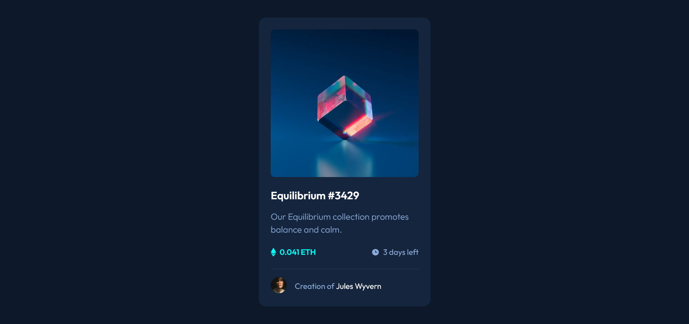

## Jump To

- [Screenshot](#screenshot)
- [Links](#links)
- [My process](#my-process)
  - [Built with](#built-with)
- [Author](#author)

### Screenshot

### Links

- Github Pages: [View Online](https://gkhuskivadze.github.io/NFT-Card-Markup/)

### Built with

- Semantic HTML5 markup
- CSS
- Flexbox

### Step-Summary

- Universal Selector used to reset margin and padding to zero, also box-sizing set to bordex-box for box model.
- Instead of pixel unit I used rem, gave fixed number of 10px but with percent to html element to not lose option for font size manipulation.
- There is one main container whose height is set to match full viewport using vh unit.
- To center various elements I used Flexbox.
- To make a transparent color change for picture when hovered I used position property.

## Author

- LinkedIn - [Giorgi Khuskivadze](www.linkedin.com/in/gkhuskivadze) 
